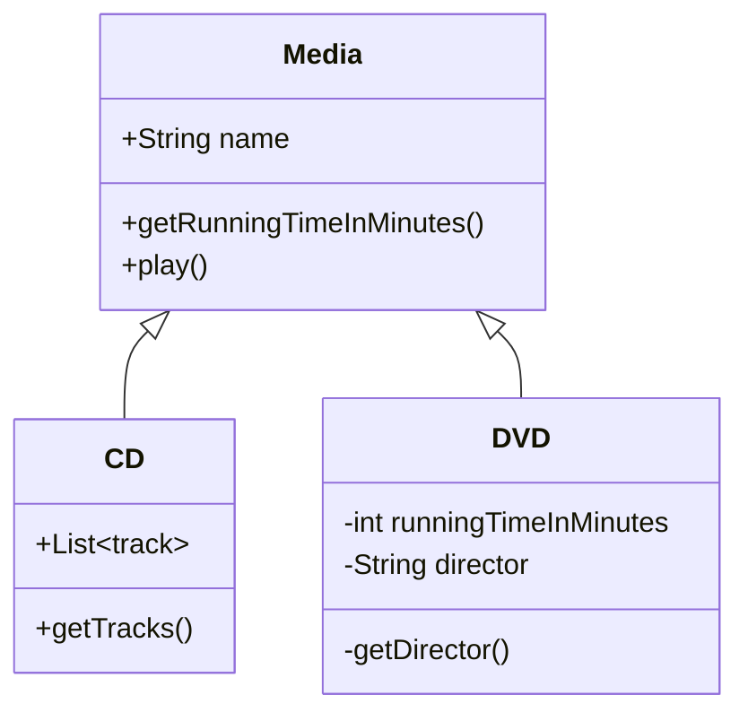
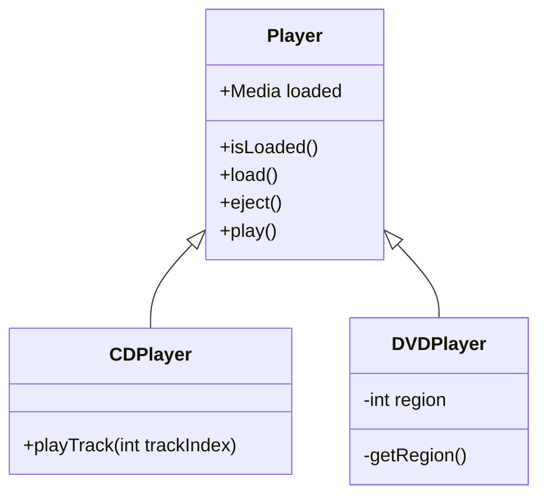

# First Tasks!

## Github

* Create a Github account
* Add me as a friend (Louisblack) and each other
* Create a new repository (initialise with a readme)
* Add a branch protection rule on main to require pull requests.
* Clone that new repository to your laptop using SSH (you’ll need to set up SSH keys in Github).
* Create a new branch
* Update your readme file to add the markdown header “Media Players”
* Commit to your branch with a descriptive commit message
* Push your branch to Github
* Open a pull request and add me as a reviewer.
* Merge the PR!

## Objects and Inheritance 

First create a Maven project and ensure it has Junit 5 as a dependency and Surefire plugin so you can run the tests (you can just grab the Junit 5 Maven starter from Github).

Because I’m old the first domain modelling thing I could think of was physical media so we’ll do that!

First we want our Media classes. We have CDs and DVDs and they both inherit from the **abstract** class Media.



For CDs, `getRunningTimeInMinutes()` should return the run times of all the tracks summed
and `play()` method should return a String like...

```
Playing track 1 - Plainsong
Playing track 2 - Pictures of You
```

For DVDs, `getRunningTimeInMinutes()` can just return the property value
and `play()` should return a string like...

```
Playing Dawn of the Dead by George A Romero
```

And then we have our players. We have the generic abstract class `Player<T extends Media>`.
When you extend this class, you have to define what type of Media your player will accept.

For example, a CD player can only play CDs so it will be defined like...

```java
public class CDPlayer extends Player<CD>
```

Whereas a DVD player can accept both types of media so it can be defined with...

```java
public class DVDPlayer extends Player<Media>
```

The methods in the abstract class can use the `T` generic instead of the actual class. For example:

```java
public abstract class Player<T extends Media> {

    protected Optional<T> loaded = Optional.empty();

    public abstract void load(T disc) {
        if (this.loaded.isPresent()) {
            throw new IllegalStateException("Disc already loaded");
        }
        this.loaded = Optional.of(disc);
    }
```

So our class inheritance structure will looks something like...



For `CDPlayers`, the `play()` method should return a string with the `play()` output from the CD if it's loaded.
The `playTrack(int trackIndex)` should return the String...

```
Playing track 1 - Plainsong
```

For `DVDPlayers` if the disc is loaded, then the `play()` method should return a string like...

```
Turning on the TV
Playing Dawn of the Dead by George A Romero
```

If no disc is loaded it should return the String...

```
Turning on the TV
Oh no, no disc loaded!
```

### Testing

The classes should have some tests. For example, for the `CDPlayer` class we could have...

```java
    @Test
    void should_eject_a_cd() {
        CDPlayer cdPlayer = new CDPlayer();

        cdPlayer.load(disintegration);

        assertThat(cdPlayer.isLoaded()).isTrue();

        cdPlayer.eject();

        assertThat(cdPlayer.isLoaded()).isFalse();
    }

    @Test
    void should_throw_exception_when_cd_already_loaded() {
        CDPlayer cdPlayer = new CDPlayer();

        cdPlayer.load(disintegration);
        
        assertThrows(IllegalStateException.class, () -> {
            cdPlayer.load(wish);
        }, "Disc already loaded");
    }
```

## Github Actions

Now you've got a repository and a project, you can make sure your tests are run whenever you make a change.

* Create a new branch of your repository created above.
* Copy your code into that repository folder.
* Set up  `.gitignore` file so you don't commit your `target` and `.idea` directories or your `*.iml` file.
* Set it up so Github will run `mvn test` when you open a new PR or merge to `Main` https://docs.github.com/en/actions/use-cases-and-examples/building-and-testing/building-and-testing-java-with-maven
* Merge your PR to main
* Update the settings for your repository so that you can only merge your PR when your tests are passing.
* Create a new branch, make a breaking change, open a PR and see it blocking you merging and assign me as a reviewer.
